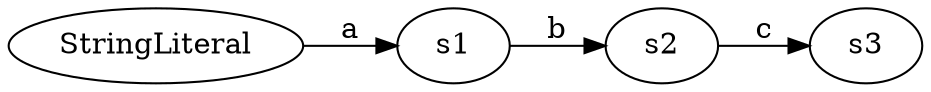

# Notes

Test runner should insert ATN section after execution

# Grammars

```antlrv4
lexer grammar Test;
A: 'A';
B: 'B';
C: 'C';
```

# Atn


```dot
digraph {
    rankdir=LR;

    StringLiteral -> s1 [label="a"]
    s1 -> s2 [label="b"]
    s2 -> s3 [label="c"]
}
```

# Input

```
A B C
```