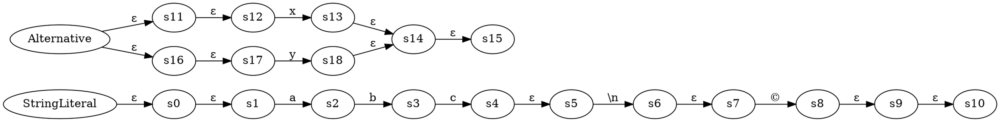

# Grammars

```antlrv4
lexer grammar Test;
StringLiteral: 'abc' '\n' '\u00A9';
Alternative: 'x' | 'y';
```

# Atn


```dot
digraph ATN {
  rankdir=LR;

  StringLiteral -> s0 [label="ε"]
  s0 -> s1 [label="ε"]
  s1 -> s2 [label="a"]
  s2 -> s3 [label="b"]
  s3 -> s4 [label="c"]
  s4 -> s5 [label="ε"]
  s5 -> s6 [label="\\n"]
  s6 -> s7 [label="ε"]
  s7 -> s8 [label="©"]
  s8 -> s9 [label="ε"]
  s9 -> s10 [label="ε"]

  Alternative -> s11 [label="ε"]
  s11 -> s12 [label="ε"]
  s12 -> s13 [label="x"]
  s13 -> s14 [label="ε"]
  s14 -> s15 [label="ε"]
  Alternative -> s16 [label="ε"]
  s16 -> s17 [label="ε"]
  s17 -> s18 [label="y"]
  s18 -> s14 [label="ε"]
}
```